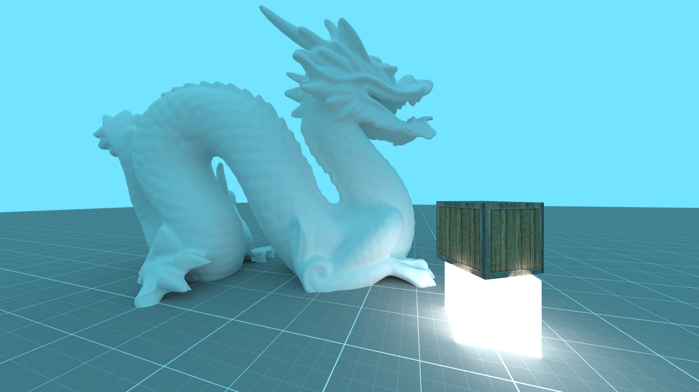
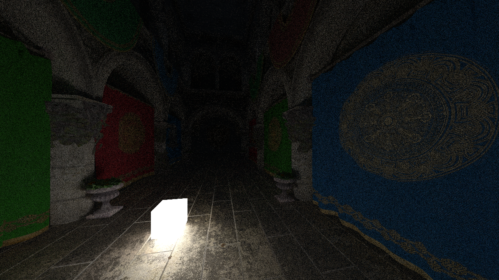
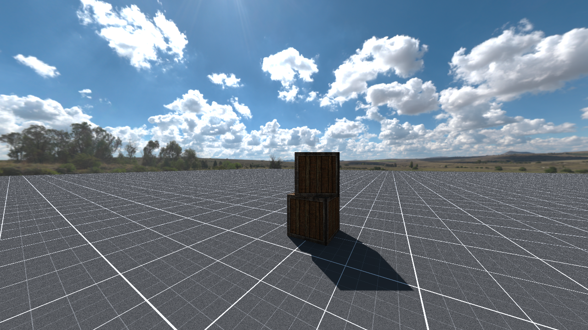

# OpenGL RT

A simple path tracer implemented in an OpenGL compute shader and C++


The program features both a raster and path traced renderer, a BVH for faster ray traversal and a GUI for quality settings.
Most of the engine code for GameObjects and project scenes was taken and expanded upon from my previous project, [CoaEngine](https://github.com/Aleksandar204/CoaEngine), but some features are not yet ported over. (See [TODO](#todo))

The camera is controlled using WASD for movement and Q and E for rotation.

## Examples
<table align=center>
 <tbody>
  <tr align=center>
   <td align=center>
    
   </td>
   <td align=center>
    
   </td>
  </tr>
  <tr>
   <td align=center>
    
   </td>
  </tr>
 </tbody>
</table>

## Building

### Requirements
 - OpenGL 4.6 capable GPU with support for `GL_ARB_bindless_texture`
 - CMake >= 3.16
 - C++ 17 capable compiler
 - GLFW, glm and assimp libraries in a place where CMake can find and link them

### Compiling (on Linux)

```
mkdir build && cd build
cmake ..
make
```

### Compiling (on Windows using vcpkg)

Copy the `CMakePresets.json` file from [the Microsoft vcpkg getting started guide](https://learn.microsoft.com/en-us/vcpkg/get_started/get-started?pivots=shell-cmd#4---build-and-run-the-project) and run the following commands:

```
vcpkg new --application
vcpkg add port assimp
vcpkg add port glm
vcpkg add port glfw3
cmake --preset=default
cmake --build build
```

## TODO
To port from CoaEngine:
 - Lit shader for raster
 - Skybox for raster renderer
 - Transparency

To implement:
 - Refraction and semi transparent materials
 - Normalmapping
 - ~~Emission maps~~
 - ~~Exporting render to image~~

## Resources and libraries used
- https://learnopengl.com/
- https://raytracing.github.io/
- [Coding Adventure: Optimizing a Ray Tracer (by building a BVH)](https://youtu.be/C1H4zIiCOaI?si=MY3VeW-_knGB7K3Q) by Sebastian Lague
- [ImGui](https://github.com/ocornut/imgui)
- [stb_image and stb_image_write](https://github.com/nothings/stb)
